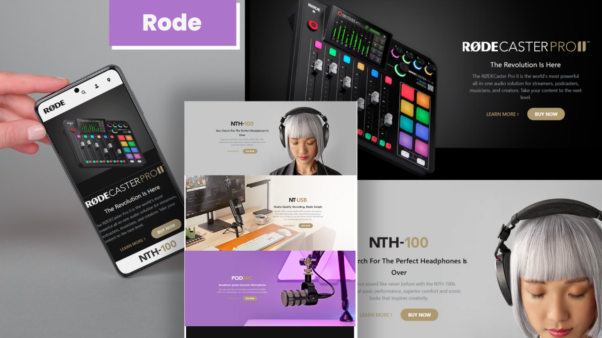

# Project 18 - with HTML and Tailwind CSS

by Divesh Thakre

 

[Deployed link ](https://divesh18.netlify.app/)

## what concepts i Learned by Creating this website?

- This project was long i used some flex-box.
- Gained confidence on Tailwind css .
- learned to plan layouts.
- learned to position html elements.
- learned to make wensite responsive for all devices.

### Time Taken For this project is around 13 hrs.
